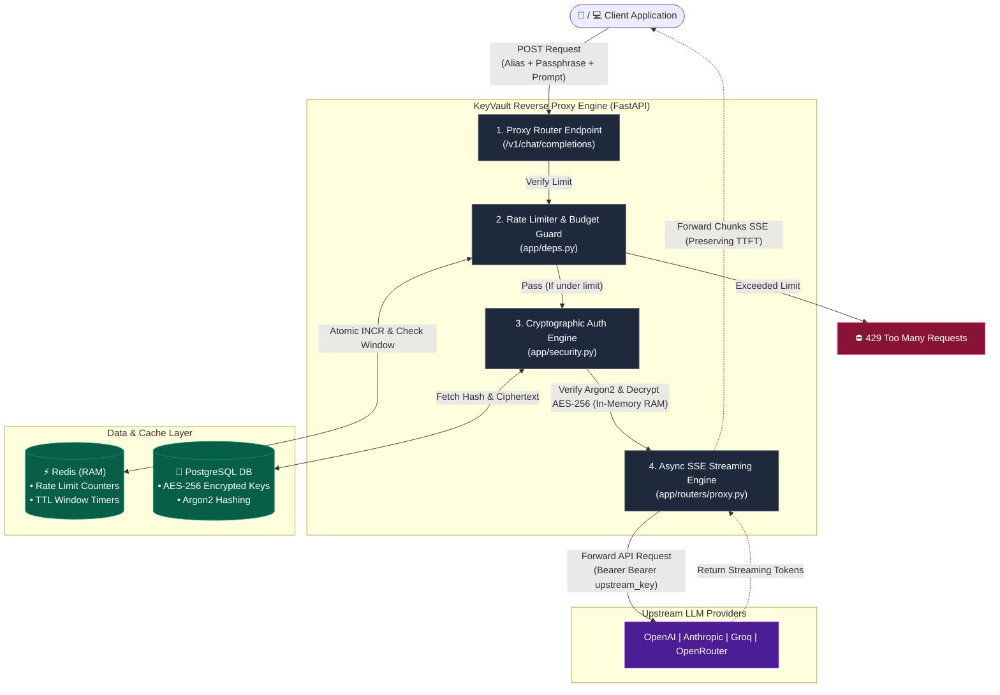

# KeyShort

Secure API key management for AI applications.

Store provider API keys once, expose only short aliases (key1, key2...), enforce rate limits and spend caps, receive alerts, and revoke access instantly without rotating the underlying secret.

🌐 Live Demo
https://keyvault-2yfb.onrender.com

## Why KeyShort?

Sharing raw API keys across multiple applications is risky.

If a key leaks, you often have to rotate it everywhere it's is used.

KeyShort introduces an alias layer.

Applications authenticate using aliases instead of real provider secrets.

The real API key never leaves the vault.

| Feature | Description |
|---------|-------------|
| Alias-based routing | Never expose provider keys |
| AES-256 Encryption | Secrets encrypted at rest |
| Monthly spend caps | Prevent unexpected bills |
| Rate limiting | Redis-backed hot path |
| Passphrase protection | Extra security per alias |
| Telegram alerts | Leak and spend notifications |
| Usage tracking | Historical analytics |
| Soft revoke | Disable aliases without deleting history |




One FastAPI process serves both the dashboard (server-rendered Jinja2 + HTMX) and the proxy. Postgres on Neon, Redis for the hot-path counters, deployed on Render.

## How a call flows

```text
POST /proxy/key2/v1/chat/completions   Authorization: Bearer key2
  |
  ├─ resolve alias            (Postgres)
  ├─ active == false?         -> 403
  ├─ passphrase required?     -> verify "key2<pass>", else 401
  ├─ rate limit in Redis?     -> 429   (~0ms, no DB)
  ├─ cached spend >= cap?     -> 402   (~0ms, Redis; DB only on cache miss)
  ├─ forward to provider with the real key, stream the response straight back
  └─ BackgroundTask: parse usage -> cost -> Redis INCR + usage row + alerts
```

Nothing blocking sits between the pre-checks and the provider call, and all accounting happens after the last byte reaches the caller.

## Local run

```bash
cd backend
python -m venv .venv && source .venv/bin/activate
pip install -r requirements.txt
cp .env.example .env

# generate the AES key that encrypts stored provider secrets
python -m app.security          # paste the output into ENCRYPTION_KEY

alembic upgrade head
uvicorn app.main:app --reload
```

Open http://localhost:8000, register, add a key.

You need a Postgres and a Redis reachable from your machine. `docker run -p 6379:6379 redis:7-alpine` covers Redis; Neon's free tier covers Postgres.

## Deploy: Neon + Render

1. **Neon** — create a project, copy the connection string into `DATABASE_URL`. The app rewrites `postgres://` to the async driver automatically.
2. **Redis** — create a Render Key Value instance (free) or an Upstash database, copy its URL into `REDIS_URL`.
3. **Render** — New > Blueprint, point it at this repo. `render.yaml` defines the web service and the keep-alive cron. Fill in the `sync: false` env vars in the dashboard:
   - `DATABASE_URL`, `REDIS_URL`
   - `ENCRYPTION_KEY` (output of `python -m app.security`)
   - `PUBLIC_BASE_URL` (e.g. `https://keyshort.onrender.com`) — used in the curl snippets
   - `TELEGRAM_BOT_TOKEN`, `TELEGRAM_CHAT_ID` (optional, for push alerts)
4. Build runs `alembic upgrade head`, so schema changes ship with deploys.

### Keeping the free service awake

`scripts/keepalive.py` runs every 10 minutes as a Render Cron Job. It hits `/healthz` (which pings Postgres and Redis) so the instance never spins down, and it re-syncs the Redis spend counters from the authoritative Postgres rows.

Any external pinger works too — point it at `https://<your-app>/healthz`.

## Using an alias

```bash
curl https://<your-app>/proxy/key2/v1/chat/completions \
  -H "Authorization: Bearer key2" \
  -H "Content-Type: application/json" \
  -d '{"model":"gpt-4o-mini","messages":[{"role":"user","content":"hi"}]}'
```

With OpenAI's SDK:

```python
from openai import OpenAI
client = OpenAI(api_key="key2", base_url="https://<your-app>/proxy/key2/v1")
```

Everything after `/proxy/<alias>/` is forwarded verbatim to the provider, including streaming responses.

**Passphrase-protected aliases** send `key2<passphrase>` as the token — the suffix is stripped and verified with argon2 before anything is forwarded. Five failures in ten minutes raises a leak alert.

**Machine-readable status:** `GET /proxy/<alias>/status` returns active flag, month-to-date spend, and configured limits.

## Behaviour notes

- **Soft delete.** Revoke flips `api_keys.active` to `false`. There is no `DELETE` statement anywhere in the app; usage history and alerts survive and the alias can be re-activated.
- **Costs are estimates.** `app/pricing.py` holds a per-model price table applied to the tokens the provider reports. Unknown models fall back to a generic rate; responses with no parseable usage are charged a flat `FLAT_UNKNOWN_CALL`. Edit that file to match your actual pricing.
- **Notify vs block.** Each limit has a mode. `notify` records the alert and lets the call through; `block` rejects at the pre-check with 429 (rate) or 402 (spend).
- **Spend window** is the calendar month, UTC.
- **Secrets at rest** are AES-256-GCM encrypted with `ENCRYPTION_KEY`. Rotating that value makes existing stored keys undecryptable — re-enter them if you rotate it.

## Layout

```text
backend/
  app/
    main.py        app wiring
    config.py      env settings
    db.py          async SQLAlchemy engine
    models.py      users, api_keys, key_limits, key_usage, alerts
    security.py    argon2 + AES-GCM + signed sessions
    cache.py       Redis counters
    pricing.py     token -> USD
    usage.py       alias lookup + pre-checks
    providers.py   base URLs, auth headers, probe endpoints
    notify.py      alerts + Telegram
    routers/       auth, keys, proxy, alerts, health
    templates/     Jinja2 + HTMX
  migrations/      Alembic
  scripts/keepalive.py
  render.yaml
```
